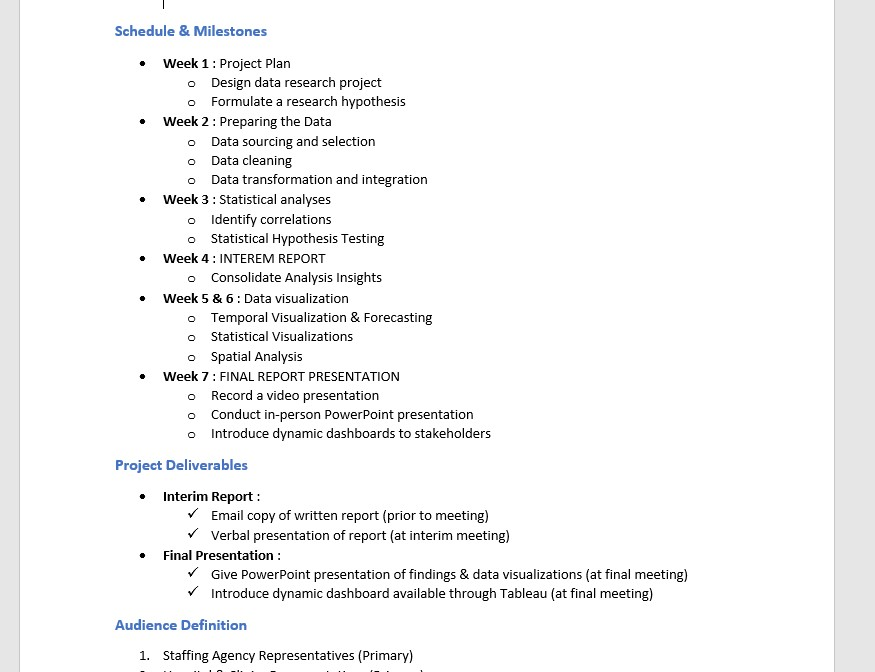
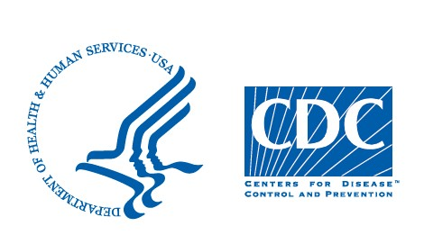
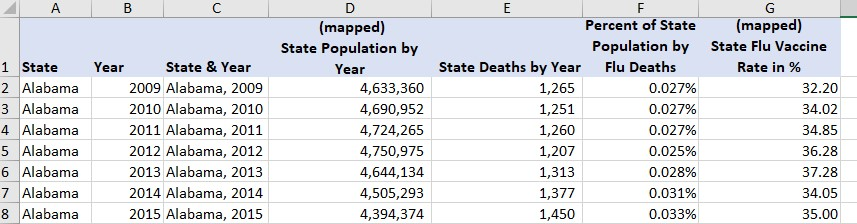
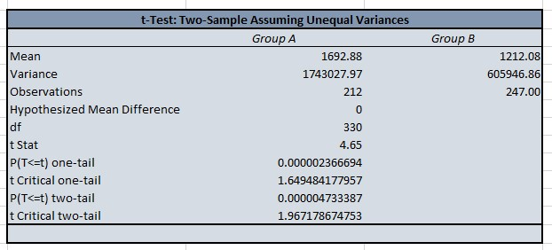
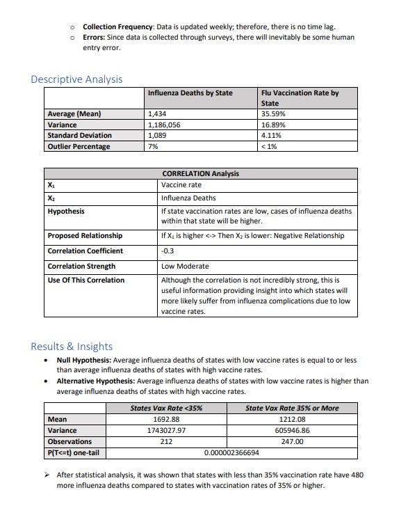
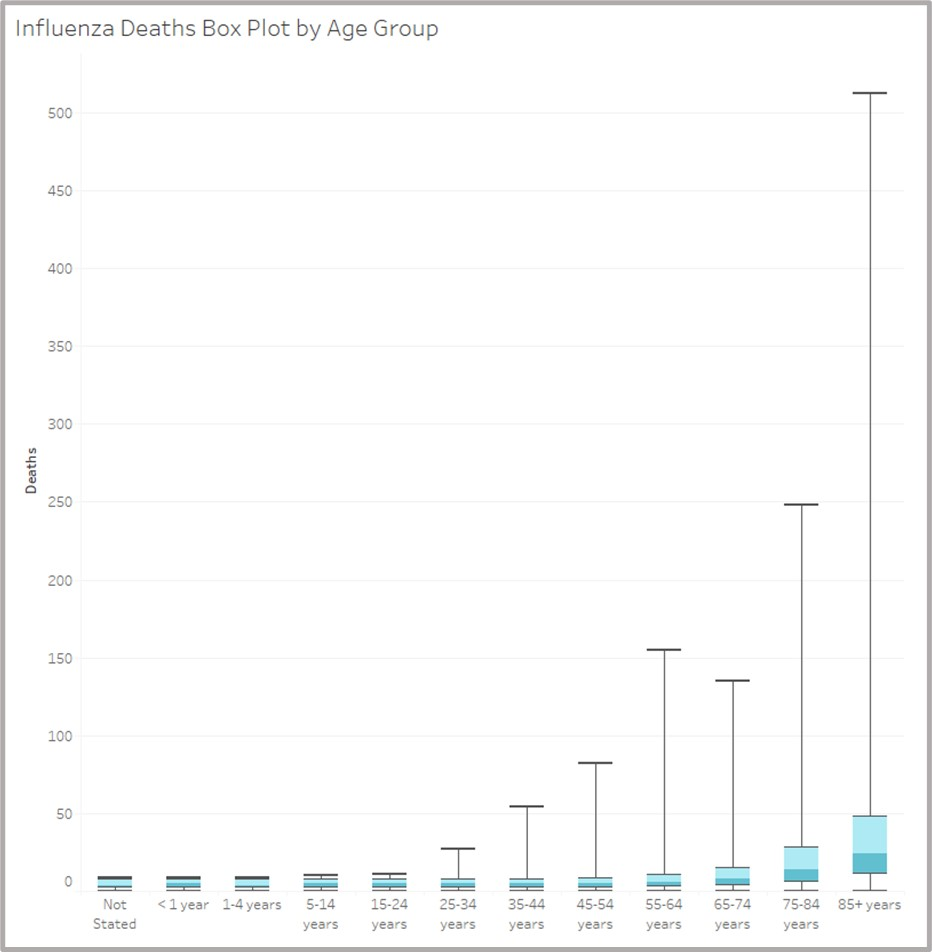
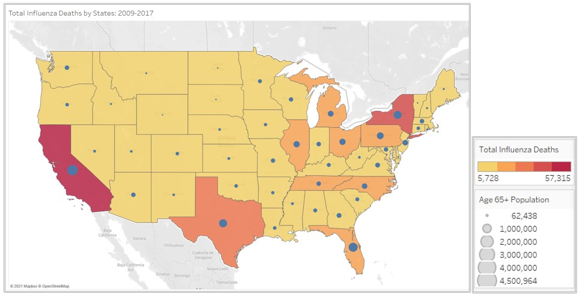
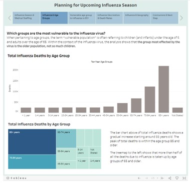
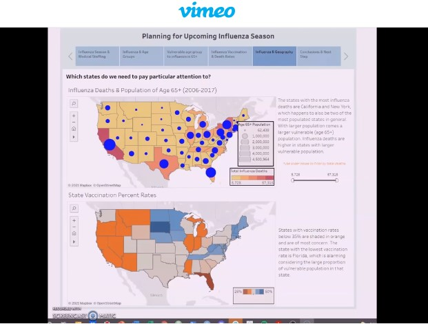

  <a href="https://tiltonneena.github.io/portfolio/">Back to Portfolio Homepage</a>

# Influenza Season in the U.S.
### By Neena Tilton

  

### Background
A medical staffing agency needs to proactively plan for sending temporary medical workers to clinics and hospitals across the U.S. for the upcoming influenza season. To achieve this, an analysis determining influenza trends and the count of vulnerable populations for each state much be performed. 

### Tools & Context
- **Excel:** the bulk of the analysis was performed on this spreadsheet software, including data integration, cleaning, and transformation using pivot tables, along with hypothesis testing and statistical analysis using Analysis ToolPak (an Excel add-in for statistical functions). 
- **Tableau:** all of the visualizations and the final presentation for this project were created within this visualization software, including temporal forecasting, geospatial visualization, treemaps, and final dashboard. 

### Data Source
Although this is a fictional medical staffing agency, the data sets obtained for this project were from real and publicly available governmental sources. 
- [Influenza deaths by geography, time, age, and gender – CDC](https://github.com/tiltonneena/InfluenzaSeason-Project/blob/main/Datasets/CDC_InfluenzaDeaths.xlsx) 
- [Population data by Geography – U.S. Census Bureau](https://github.com/tiltonneena/InfluenzaSeason-Project/blob/main/Datasets/USCensus_PopulationData.xlsx)
- [Vaccination data by State - CDC](https://github.com/tiltonneena/InfluenzaSeason-Project/blob/main/Datasets/CDC_StateFluVaxData.csv)

### Methodology
1.	Before any analysis, initial project management plan was drafted for the purpose of stakeholder communication. The project management plan included meeting schedules, milestones, and final deliverables proposal, outlining the project plan for accomplishing given business requirements.  

    

      
    

    

      <em>A section from the project management plan highlighting the projected schedule for completing this project.</em>
    

2.	Once a plan was drafted, the analysis began with finding publicly available datasets and vetting them for data integrity. Beyond them being from credible governmental sources, other data integrity factors were taken into consideration, such as the relevancy of the data, any potential biases present, data limitations, timeliness, and any other issues related to the data collection process.

    

      
    

   
    

      
    

3.	After the process of vetting the reliability of datasets, the three selected datasets were cleaned, formatted to be consistent with one another, and fully integrated into one large dataset.  

    

      
    

4.	Statistical analysis and hypothesis testing was performed on the sample data to find if there were any differences between vaccinated and unvaccinated groups. This was then followed by an interim report for stakeholders. 

    

      
    

    

      <em>The two-sample t-test found that the death rates due to influenza in states with vaccination rates below 35% was higher than the states with vaccination rates above 35%. </em>
    

    
    

      
    

    

      <em>The interim report included descriptive analysis of the dataset, results of the hypothesis test, and further plans for the remainder of the analysis.</em>
    

5.	Data visualizations were created in Tableau to complete the rest of the analysis. 

    

      
    

    

      <em>A box plot made in Tableau showing the distribution of influenza deaths within different age groups.</em>
    

    
    

      
    

    

      <em>A combination choropleth and graduated symbol map made in Tableau showing size of vulnerable populations (blue circles) within each states overlayed on the count of influenza deaths (yellow to red gradient).</em>
    

    
6.	Final report was created in a dashboard format within Tableau. Performed the final presentation for stakeholder in recorded video form. 

### Key Findings
- Hypothesis testing showed that higher vaccination rate does decrease the average influenza
deaths, however, real impact only started to show when state rate reached at least 38% or higher. 
- Higher concentration of vulnerable population had a much clearer impact on total death count then vaccination rates, thus prioritizing states with most vulnerable population was recommended for future staffing needs.
- The states with the highest concentration of vulnerable population are California, Florida, Texas, and New York. These states should be prioritized when sending medical staff for the season. 

### Deliverables
### [Interim Report](https://github.com/tiltonneena/InfluenzaSeason-Project/blob/main/InterimReport.pdf)

  
 

### [Tableau Dashboard](https://public.tableau.com/app/profile/neena1744/viz/InfluenzaWorkbookII/InfluenzaMedicalPlanningStory)

  
 

    
### [Video Presentation](https://vimeo.com/652267376)

  

### Next Steps
This analysis did not cover the seasonality of the flu season for each state. Next steps will take this into consideration to draft the most optimal scheduling for sending temporary medical workers to each state.  

  <a href="https://tiltonneena.github.io/portfolio/">Back to Portfolio Homepage</a>

